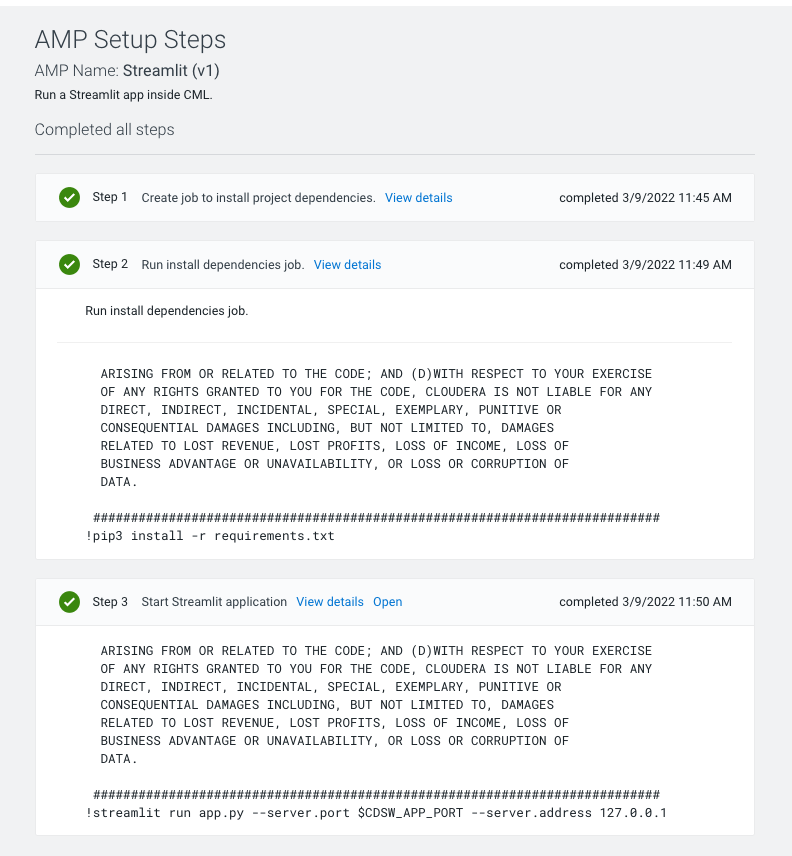

# SSB2CML Demo

This demo shows how you can create a real time dashboard in the Cloudera Data Platform. In order to execute it you need the following prerequisites:

* A Cloudera Machine Learning (CML) Workspace
* A Cloudera Streaming Analytics (CSA) DataHub with SQL Stream Builder
* CDP Data Lake Permissions including Ranger and proper ID Broker Mappings 

## Part 1 - Deploy Streamlit AMP

From your CML Workspace, click on the AMPs tab on the left side panel

A series of AMPs will be loaded in the middle of the screen. Select the Streamlit AMP as shown below. If you don’t see the Streamlit AMP you can load it into the AMP catalog following instructions (here).

Click the “Configure Project” button. A window with deployment options will appear. You can leave default settings (default AMP settings are normally vetted by the Fast Forward Labs team who are in charge of AMPs). 

If it is enabled, you can optionally disable the Spark option as it is not needed. 

Next, click on the “Launch Project” button at the bottom right. CML will automatically build the AMP project for you. This build should take 5-10 minutes at most. 

Please feel free to stretch your legs and grab a coffee!

You can now access the AMP by going back to the Projects homepage and opening the project. CML automatically names the project with the AMP title and your username, in my case “Streamlit - pauldefusco”.

Notice the README file is automatically loaded for you. This contains useful information about the AMP. 

Next, familiarize yourself with the Streamlit application. Open “Applications” on the left side panel and then on the “Streamlit App” box

Your browser will open a new window with the Streamlit dashboard

So how does this work? The actual code for the Streamlit dashboard is in the app.py file located in the project home folder. The CML Applications feature loads the script in a container and provides an endpoint for serving the app. 

The data rendered by the dashboard is stored in the seaborn-data folder in the project home folder. Notice this is a small static csv file. The data is loaded in the application once and it does not mutate. 

Author recommendation: feel free to click on the app.py script to see the application code, or the heyser.csv file located in the “seaborn=data” folder to inspect the data. 

Next, we will create a Flink table with SQL Stream Builder to create some more fake data for the CML Application. The goal is to have a dashboard showing insights in real time. 

## Part 2 - Create a streaming table in SQL Stream Builder

Navigate to the Data Hub Clusters page from the CDP home page, then open the CSA cluster

And click on the Streaming SQL Console icon to open SQL Stream Builder

SQL Stream Builder is a service to create queries on streams of data through SQL. It is part of Cloudera Streaming Analytics and is available both in Cloudera Private and Public Cloud.

Recommendation: for more information on this, please visit the following links:

SSB Documentation
SSB Short Intro video
SSB Webinar

Next, we will create a Flink table from the SQL Console and populate it with fake data with Flink-Faker.

Please navigate to the Console -> SQL tab and select “Templates” -> “Faker”

To create the Flink table, replace the auto-populated SQL syntax with the following SQL DDL:

CREATE TEMPORARY TABLE geyser_ssb (
  `duration` DECIMAL,
  `waiting` INT, 
  `kind` STRING, 
  `timestamp` TIMESTAMP(3)
) WITH (
  'connector' = 'faker', 
  'fields.duration.expression' = '#{number.numberBetween ''1'',''5''}',
  'fields.waiting.expression' = '#{number.numberBetween ''0'',''100''}',
  'fields.kind.expression' = '#{regexify ''(long|short){1}''}', 
  'fields.timestamp.expression' = '#{date.past ''2'',''SECONDS''}'
);

Submit the Flink Job by clicking on the “Execute” button on the right hand side of the screen. Please validate that the table has been created by checking in the Logs tab below. 

Note you have created a table with the same attributes that were present in the geyser.csv file we inspected in CML, plus a timestamp field. 

Next, we will create a Materialized View. Replace the SQL syntax in the console with the following query. Do not submit the job.

SELECT * FROM geyser_ssb;  

Leave the syntax unchanged and open the “Materialized View” tab:

After a few seconds the Configuration tab will automatically detect the query and inspect potential primary keys. 

You can ignore any initial messages. After a few seconds you will be able to change the “Materialized View” setting from “Disabled” to “Enabled and select “timestamp” as the primary key. 

The remaining options can be left to their default values.  

The next screen displays a set of configurations for the View. Please name the URL Pattern as shown with “SSB2CML” and make sure to “Select All” fields. 

Save the configuration and patiently wait a moment for the URL Pattern tab to be populated with the endpoint at the bottom of the screen. 

Copy the URL to your clipboard. We will use it in CML. 

Next, do not navigate away from the console. Go back to the “SQL” tab and execute the job.

After a few moments the job will start and you will see live updates in the Results tab. Your Flink job is running and all with the ease of a SQL query!

## Part 3 - Modify your dashboard to consume real time data from SSB 

Navigate back to the CML Workspace and open the CML Project where you deployed your dashboard i.e. “Streamlit - yourusername”.

Navigate to the Applications tab and remove the current application.

Next, navigate to the project home folder by clicking on “Overview” and open the requirements.txt file. Click on “Open in Workbench” at the top right to edit it. 

Do not remove the current file contents. Rather, move the cursor to line 3 and add the following entries. Please make sure you enter each entry in a single line.

pandas
streamlit-autorefresh
numpy
requests-kerberos

Navigate to the Jobs tab from the left side panel. Notice the “Install Dependencies” job has already run once during the AMP build. You can rerun the job by simply clicking the “Run” button on the right side. This will update the CML project dependencies with the new additions.
 

Next, navigate to the “Project Settings” tab on the left side panel and then open the “Advanced” tab. Create a new environment variable with the SSB Materialized View url you copied to the clipboard. 

If you lost the URL value, you can navigate back to SSB and access it from the Materialized Views tab. 

Name the variable “SSB_MV” by entering “SSB_MV” on the left side and paste the SSB url you copied to the clipboard on the right side as shown below.

One last step: navigate back to the Overview tab and open the app.py file. Replace its contents with the following (a copy is stored in app.py in this repository)

You are now ready to deploy the new application with streaming data. Navigate to the Applications tab on the right side. Create a new application with the following settings:

Name: Streaming Dashboard
Subdomain: StreamingApps
Script: cml/launch_app.py
Resource Profile: at least 4vCPU / 8 GiB Memory recommended

No other values require modification. If you can’t find a resource profile with 4 vCPU / 8 GiB Memory, you can add it at the workspace level by navigating to “Site Administration” -> “Runtime/Engine” -> “Resource Profiles”. You will need Administrator rights to the workspace in order to do that. 

Click create and then wait for the Application to launch. This might take up to a minute or two but shouldn’t take longer than that. 

Notice that now both the table with summary statistics and the jointplot are updating in realtime. Streamlit has a built-in method named “st_autorefresh” that allows you to set update frequency. In app.py this has been added at line 57 and update frequency has been set at once per second. 

Obviously this should be used carefully as we are effectively reloading the entire dataset (4 attributes x 300 rows ca.) into the container every second.  

